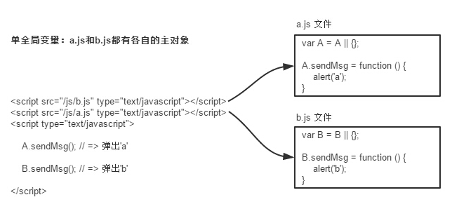

:::tip js规范
1. 命名规范\
变量名推荐使用驼峰法来命名(camelCase)；\
常量名必须使用大写
2. 代码缩进\
通常使用 4 个空格符号来缩进代码块；
3. 空格与运算符\
通常运算符 ( = + - * / ) 前后需要添加空格；
4. 文件名统一\
统一小写，必填后缀
5. 变量声明\
单行声明，不要在同一行声明多个变量
6. 比较运算符\
使用 ===/!==来比较 true/false 或者数值
7. 对象声明\
使用对象字面量代替new Array 这种形式
8. 注释\
/**
* @name ice_yulong
* @Date 2022-02-02 14:50:39
* @introduction 简述
* @description 详细描述
* @param {参数类型} 参数 参数说明
* @return {返回类型说明}
* @exception [违例类型] [违例类型说明]
*/
9. 全局变量\
慎用全局变量，在引入第三方js文件时需要声明各自主对象

10. 字符串\
变量统一使用单引号
11. 定时器的使用\
定时器使用后要注销
12. 日志信息\
慎用console.log()，及时清理，避免污染
13. 函数\
函数定义首字母大写\
函数返回类型保持统一\
函数参数数量不宜过多，尽量不超过7个，参数过多时，可考虑封装为一个对象\
14. 代码优雅\
不在文件中留下未来不再确定使用的代码块\
不重复定义方法（抽离出公共的方法）\
代码优化，提高效率\
循环中慎用dom操作

:::